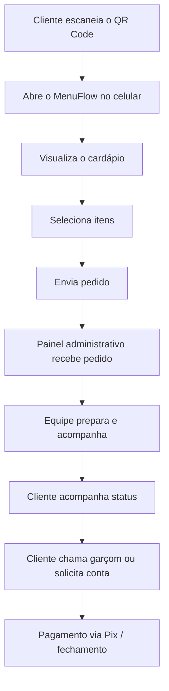
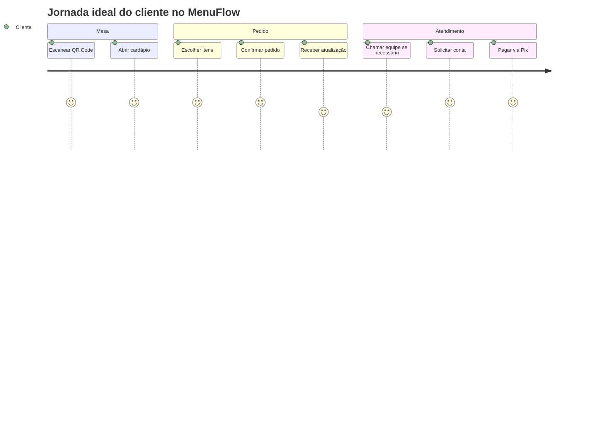

<div align="center">

# 🍽️ MenuFlow


<p>
  
  
  
  
</p>

<p>
  <a href="#-visão-geral">Visão geral</a> •
  <a href="#-funcionalidades">Funcionalidades</a> •
  <a href="#-arquitetura-da-ideia">Arquitetura</a> •
  <a href="#-roadmap">Roadmap</a> •
  <a href="#-sobre-o-projeto">Sobre</a> •
  <a href="#-autor">Autor</a>
</p>

</div>

---

## ✨ Visão geral

O **MenuFlow** é um sistema de atendimento digital pensado para restaurantes, bares, cafeterias e operações de alimentação que querem modernizar a experiência do cliente sem perder controle operacional.

A proposta é simples e poderosa:

- o cliente **escaneia o QR Code da mesa**
- acessa o **cardápio no próprio celular**
- faz o **pedido sem depender do atendimento inicial**
- acompanha o status do pedido
- chama a equipe quando precisar
- solicita a conta
- e pode concluir o fluxo com **pagamento via Pix**

Mais do que um cardápio digital, o MenuFlow foi pensado como um **ecossistema de atendimento**, unindo experiência do cliente, agilidade operacional e visão de produto.

> Este projeto representa minha evolução prática em desenvolvimento, estruturação de sistemas, automação de processos e construção de soluções reais com apoio de IA.

---

## 🎯 Problema que o MenuFlow resolve

Muitos restaurantes ainda sofrem com problemas como:

- demora no primeiro atendimento
- erro na anotação de pedidos
- retrabalho no salão
- filas e gargalos no fechamento da conta
- falta de rastreabilidade do pedido
- experiência ruim para o cliente

O **MenuFlow** nasce para reduzir esse atrito e tornar o fluxo mais fluido, moderno e escalável.

---

## 🧩 Funcionalidades

### 👤 Área do cliente

- 📷 Acesso por **QR Code na mesa**
- 📖 Visualização do **cardápio digital**
- 🛒 Realização de pedidos pelo celular
- 🔔 Chamada do garçom/equipe
- 🧾 Solicitação de conta
- 📦 Acompanhamento do pedido/status
- 💸 Pagamento via **Pix**
- 📱 Experiência simples e direta, sem necessidade de instalar aplicativo

### 🧑‍💼 Área administrativa

- 📋 Painel administrativo para acompanhamento de pedidos
- 🧠 Controle do fluxo de atendimento
- 🍔 Gestão de produtos e categorias do cardápio
- 📊 Histórico e organização dos pedidos
- ⚙️ Configurações do restaurante
- 🎨 Possibilidade de personalização visual por cliente
- 🪑 Estrutura pensada para trabalhar com **mesas**, atendimento local e operação real

### 🚀 Expansões previstas

- autenticação de usuários
- múltiplos restaurantes na mesma base
- plano SaaS
- relatórios gerenciais
- reservas
- identidade visual por restaurante
- histórico mais avançado
- gestão de comandas
- automações operacionais

---

## 🖼️ Preview do projeto

> Troque os links abaixo pelas imagens reais do sistema assim que subir os prints no GitHub.

<div align="center">
  
</div>

<br />

<div align="center">
  
  
  
</div>

---

## 🧠 Arquitetura da ideia



### Fluxo resumido de produto



---

## 🛠️ Stack e construção

> Ajuste esta seção conforme a stack final do repositório.

<div align="center">
  
</div>

### Tecnologias já utilizadas/estudadas no contexto do projeto

- **JavaScript**
- **Python**
- **HTML / CSS**
- Estruturação de fluxos web
- Lógica de programação
- Integração de processos com apoio de IA
- Conceitos de automação e produto digital

### Filosofia de construção

Este projeto foi desenvolvido com apoio de inteligência artificial, mas com foco real em:

- modelagem do fluxo
- definição de funcionalidades
- visão de produto
- resolução de problema prático
- organização de lógica
- melhoria contínua

Ou seja: não é apenas "gerar código". É **entender a necessidade, estruturar a solução e transformar em sistema**.

---

## 📁 Estrutura sugerida do projeto

> Exemplo visual para o repositório ficar mais profissional. Adapte conforme sua estrutura real.

```bash
MenuFlow/
├── frontend/
│   ├── public/
│   ├── src/
│   │   ├── components/
│   │   ├── pages/
│   │   ├── services/
│   │   ├── styles/
│   │   └── utils/
│   └── package.json
├── backend/
│   ├── src/
│   │   ├── controllers/
│   │   ├── routes/
│   │   ├── services/
│   │   ├── models/
│   │   └── config/
│   └── package.json
├── docs/
│   ├── images/
│   └── flows/
├── README.md
└── LICENSE
```

---

## 📌 Diferenciais do projeto

<details>
  <summary><strong>Clique para expandir</strong></summary>
  <br />

- ✅ Projeto orientado a um problema real de mercado
- ✅ Foco em experiência do usuário e operação do restaurante
- ✅ Visão de escalabilidade para modelo SaaS
- ✅ Construção prática com mentalidade de produto
- ✅ Uso estratégico de IA como acelerador de desenvolvimento
- ✅ Potencial de personalização por nicho (restaurante, cafeteria, marmitaria, bistrô)

</details>

---

## 🗺️ Roadmap

- [x] Conceito do produto
- [x] Estruturação da ideia principal
- [x] Definição do fluxo base de atendimento
- [x] Planejamento do painel administrativo
- [x] Visão de pagamento via Pix
- [ ] Upload de prints reais do sistema
- [ ] Organização completa do repositório
- [ ] Publicação de demo funcional
- [ ] Autenticação de usuários
- [ ] Relatórios e histórico mais avançados
- [ ] Multiempresa / múltiplos restaurantes
- [ ] Evolução para modelo SaaS

---

## 📈 Visão de negócio

O MenuFlow não foi pensado apenas como um projeto acadêmico ou um protótipo isolado.

A visão é evoluir a solução para um produto com potencial comercial real, capaz de atender múltiplos estabelecimentos com personalização, suporte e expansão de funcionalidades.

### Possíveis módulos futuros

- cardápio digital
- comandas
- pagamentos
- relatórios
- reservas
- histórico
- configurações do restaurante
- identidade visual por cliente
- automações operacionais

---

## 🔎 Sobre o projeto

O **MenuFlow** representa minha forma de construir: aprender rápido, resolver problemas, testar ideias e transformar necessidade real em solução funcional.

Mesmo estando em formação acadêmica em Engenharia de Software, busco desenvolver projetos que não fiquem apenas na teoria. Gosto de tecnologia aplicada, automação, sistemas úteis e melhoria de processos.

Esse repositório também marca minha evolução prática como desenvolvedor.

---

## 📚 Aprendizados envolvidos

- raciocínio lógico
- estruturação de sistemas
- pensamento de produto
- organização de funcionalidades
- melhoria de interface/fluxo
- uso de IA para acelerar desenvolvimento
- noção de arquitetura de solução
- visão prática de tecnologia aplicada ao negócio

---

## 💡 Próximos passos recomendados para deixar este repositório ainda mais forte

1. Subir **prints reais** do MenuFlow
2. Criar uma pasta `/docs/images`
3. Adicionar um vídeo ou GIF curto do fluxo
4. Publicar uma demo, mesmo que simples
5. Organizar commits com mensagens profissionais
6. Criar outros repositórios pequenos mostrando estudos e automações

---

## 🤝 Como esse projeto pode ser apresentado em currículo/entrevista

Você pode apresentar o MenuFlow como:

> Projeto próprio de sistema de atendimento digital para restaurantes, com foco em experiência do cliente, lógica de produto, painel administrativo e fluxo de pagamento.

Ou ainda:

> Desenvolvimento de solução digital para restaurantes, estruturando funcionalidades como cardápio via QR Code, pedidos pelo celular, acompanhamento do pedido, solicitação de conta e integração com Pix.

---

## 📬 Autor

<div align="left">

**Robert Castilho Menegussi**  
Estudante de Engenharia de Software  
Ribeirão Preto - SP, Brasil  

- 💻 Interesse em desenvolvimento de software, automação e produtos digitais
- 🧠 Uso de IA como acelerador de aprendizado e construção
- 🚀 Foco em criar soluções úteis, modernas e escaláveis

</div>

### Contato

> Substitua pelos seus links reais antes de publicar.

- Email: `robertcmenegussi@gmail.com`
- LinkedIn: INDISPONIVEL
- GitHub: `https://github.com/RobertMenegussi`

---

## ⭐ Apoie o projeto

Se você curtiu a ideia do MenuFlow, deixe uma estrela no repositório. Isso ajuda bastante e também marca a evolução do projeto. ✨

---

<div align="center">

### "Não é só sobre código. É sobre construir soluções que funcionam no mundo real."

**MenuFlow • em evolução constante**

</div>
